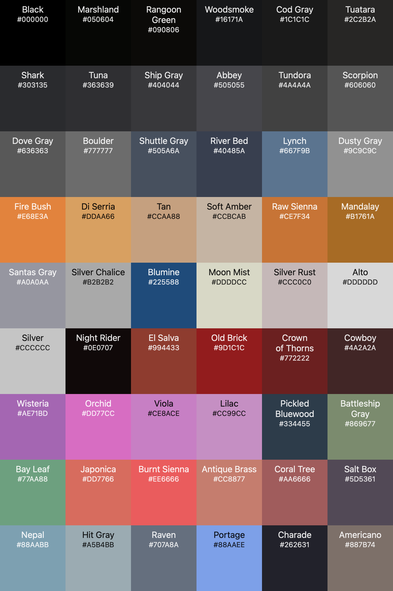

# Darkforce color

## Version 2.0

My **goal** with **darkforce** is the **easy visualization** of what **I consider important to see**.

## Design choices

- The **background color** is **black** `#000000`.

- **Normal** text is **not fully white** to **easy read** `#b2b2b2`.

- **Constants** `{ null, true, false, undefined }` are *italic* and <u>underlined</u>.

- **Numbers** are **stronge orange** `#E68E3A`.

- **Strings** are **light blue** `#A5B4BB`.

- **Comments** are **grayish blue** with *italics* `#4d5361`.

- The **return** keyword is **orange** with opacity along with *italics* `#CC8877`.

- **TODO** are  **orange** with **dark gray background**  along with **bold text** `#ddaa66`.

  ### Vim states

  - The **Search** highlight is **purple** `#AE71BD`.
  - The **Visual** highlight is **light gray** `#363639`.

## Colors

[collection css](./collection/Darkforce-vim-colors.css)

[collection json](./collection/Darkforce-vim-colors.json)

## JAVASCRIPT PLUGINS USED

-[maxmellon/vim-jsx-pretty](https://github.com/MaxMEllon/vim-jsx-pretty)

-[yuezk/vim-js](https://github.com/yuezk/vim-js)

